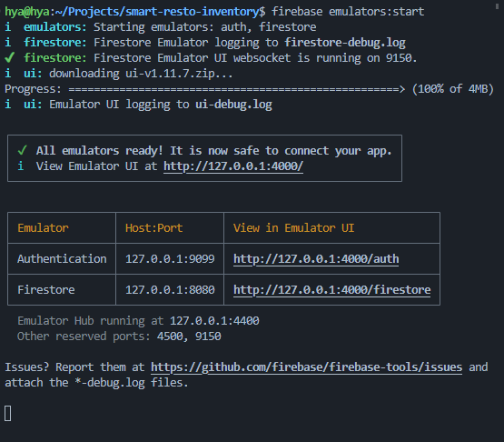

# Connect App & Start Prototyping

Here's the full guide [guide](https://firebase.google.com/docs/emulator-suite/connect_and_prototype).

## Install the CLI

Thanks to Google, they provide an easy way to install this emulator with NPM.
`npm install -g firebase-tools`

## Log in and test the Firebase CLI

Here's the detail: [CLI guidance](https://firebase.google.com/docs/cli#linux).

Now let's try to log in : `firebase login`. After this, let's test whether the CLI works or not by listing our current project.

`firebase projects:list`

It is recommended to regularly update the CLI, the way we update it, it's the same like installing it: `npm install -g firebase-tools`

Here's how to check the version: `firebase --version`.

## Locally initialize a Firebase project

Here's the video : https://www.youtube.com/watch?v=pkgvFNPdiEs

https://firebase.google.com/docs/emulator-suite/connect_and_prototype#web-modular-api_1

Before continuing, we have to ensure that we have to set up our firebase project first. In this case, since we're using authentication and also firestore, we have to enable them first.

- Go to the working directory, and then `firebase init`. Since we're only using firestore and auth then only choose "firestore" and also "local emulator".

- Choose an existing projects. Your list of projects will be listed.

- Then we can continue, and choose the default is okay though for port. When asked to choose emulator, choose auth and also firestore.

- Say Yes when it asks 'Would you like to enable the Emulator UI', and we can go default for the port. And then say yes when it asks 'Would you like to download the emulators now'

- It would generate several files:

  - `.firebaserc`
  - `firebase.json`
  - `firestore.indexes.json`
  - `firestore.rules`
  - `firestore-debug.log`
  - `ui-debug.log`

- Now run this command : `firebase emulators:start`
  You might encounter error like this :

  ```
  i  emulators: Shutting down emulators.

  Error: Could not spawn `java -version`. Please make sure Java is installed and on your system PATH.
  ```

  We have to install Java first:

  ```
  sudo apt install default-jdk
  ```

  It is mentioned that it should be Java 7 or higher. [Instruction](https://firebase.google.com/codelabs/firebase-emulator#0)

  Now check again whether the installation is success : `java --version`

  Let's run it again: `firebase emulators:start`.

  If it successful it shows all the port that our emulator runs.

  By default, the emulator UI will be in port 4000: `http://127.0.0.1:4000/`

  

  Done! Now let's try it on the app.

## Test Set up

In the firebase config file then we set something like this:

```typescript
/* eslint-disable import/no-extraneous-dependencies */
import { initializeApp, FirebaseOptions } from 'firebase/app';
import { getFirestore, connectFirestoreEmulator } from 'firebase/firestore';
import { getAuth, connectAuthEmulator } from 'firebase/auth';

const firebaseConfig: FirebaseOptions = {
  apiKey: '..',
  authDomain: '..',
  projectId: '..',
  storageBucket: '..',
  messagingSenderId: '..',
  appId: '..',
  measurementId: '..',
};

export const firebaseApp = initializeApp(firebaseConfig);
export const db = getFirestore(firebaseApp);
export const auth = getAuth(firebaseApp);

if (window.location.hostname === 'localhost') {
  connectAuthEmulator(auth, 'http://127.0.0.1:9099');
  connectFirestoreEmulator(db, '127.0.0.1', 8080);
}
```

Then now we can test our firebase locally.
